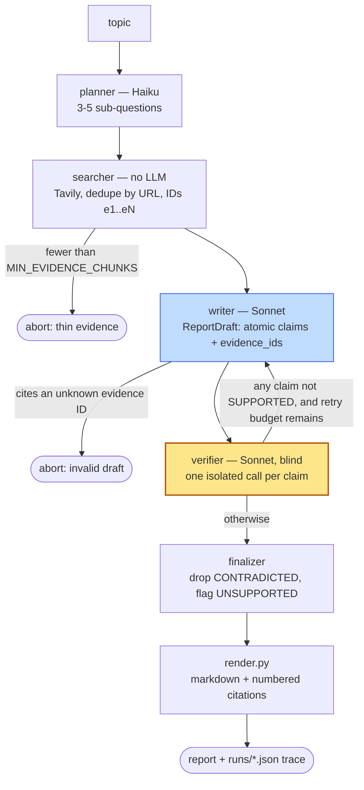

# citewise

A multi-agent research report writer whose distinguishing feature is that it
**checks its own work before shipping it**.

Most RAG report writers stop at "the model cited a source." citewise doesn't
trust that. It writes reports as *structured claims bound to evidence IDs*, then
hands each claim, one at a time, to a **blind verifier** that sees the claim and
its cited evidence and nothing else — not the draft, not the other claims, not
even the framing of the topic. Claims that fail go back to the writer with the
specific reason they failed. Claims that still fail are dropped, or shipped with
an explicit `[unverified]` marker.

The verification loop is the project. Retrieval and the UI are commodity.

---

## The verification loop



### What makes a verdict mean something

**The verifier is blind.** `build_verifier_prompt` takes a `Claim` and the
evidence pool — it is never handed the graph state, so it *cannot* leak from it.
Each claim gets its own API call with a fresh message list, so no claim's verdict
can influence another's. See [verifier.py](src/citewise/nodes/verifier.py).

**Claims are atomic.** "Commits rose 8% and review latency doubled" is two
claims, not one — a single verdict cannot express "half true." The writer prompt
pushes hard on splitting these, because compound claims are the main thing that
makes verification mushy.

**The writer cannot mark its own work.** Its output schema
([`DraftClaim`](src/citewise/nodes/writer.py)) has no `verdict` field at all.
Verdicts are the verifier's to assign.

**Revision is surgical.** On loop re-entry the writer receives only the failing
claims and the reason each one failed. Supported claims are frozen, passed
through untouched, and shown to the writer as "do not restate these." The whole
draft is never regenerated.

**Failures are visible, never silent.**

| Final verdict | What happens |
| --- | --- |
| `SUPPORTED` | Shipped normally with numbered citations. |
| `UNSUPPORTED` | Kept, prefixed `[unverified]`, and listed with its reason in an "Unverified claims" footer. |
| `CONTRADICTED` | Dropped from the report entirely, along with any section left empty. |

**It fails loudly rather than papering over gaps.** Fewer than
`MIN_EVIDENCE_CHUNKS` chunks retrieved and the run aborts with a reason — the
writer is never invoked. A draft citing an evidence ID that is not in the pool is
rejected rather than carried forward. A claim with an empty `evidence_ids` list
is invalid at the pydantic level.

**The loop provably terminates.** `retry_count` is incremented in exactly one
place — the writer, on re-entry — giving at most `1 + MAX_RETRIES` writer passes.
There is a test that proves it.

---

## Status

| Phase | State |
| --- | --- |
| 0 — Repo hygiene | done |
| 1 — Contracts, schemas, injectable LLM/search wrappers | done |
| 2 — Forward path (planner → searcher → writer) | done |
| 3 — Verification loop, finalizer, render, run persistence | done |
| 4 — Streamlit demo UI | done |
| 5 — Eval harness | **built and tested, but never run against the live API** |
| 6 — Documentation | this file |

**181 tests pass** (148 unit, 33 integration) and `ruff` is clean. No test
touches the network — Anthropic and Tavily are fully mocked from canned fixtures
in [tests/fixtures/](tests/fixtures/).

### The eval numbers do not exist yet

This is the honest gap in the project, so it gets its own heading.

Everything in [eval/](eval/) is **written and unit-tested, but has never been
executed against the real API.** The run was stopped by an Anthropic credit
limit, not by an oversight. Concretely:

- [eval/topics.yaml](eval/topics.yaml) — 10 topics exist: 5 clean factual
  subjects, 5 contested ones where sources genuinely disagree (the contested half
  is where the verifier should earn its keep). Not yet run.
- [eval/baseline.py](eval/baseline.py) — the comparison arm (same evidence, one
  Sonnet call, no loop) exists and is tested on fakes. Never run for real.
- [eval/run_eval.py](eval/run_eval.py) — the driver, the metrics
  (unsupported-claim rate, citation coverage, contradicted count, retry
  distribution, latency, token cost) and the markdown table generator are all
  implemented. The *pure* metric functions are unit-tested. The driver has never
  made a paid call.
- **There is no results table with real numbers in this repo.** `eval/results/`
  is gitignored; any local copy is a zeroed placeholder.
- [eval/score_labels.py](eval/score_labels.py) — computes the verifier's
  precision and recall against human labels, and is tested against a small
  synthetic filled sheet. But **`eval/labeling_sheet.csv` has never been
  generated**, because generating it requires a real eval run first.

So: **nothing here should be read as "citewise beats the baseline by X."** No
such measurement has been made. The architecture is built to be measurable and
the tooling to measure it is in place; the measurement itself is outstanding.

To close the gap, put real keys in `.env` and run `make eval` (or
`.\make.ps1 eval` on Windows). It costs money — `run_eval.py` is the only script
in the repo that calls a paid API. Start with `--limit 2` to see the shape of the
output before committing to all 10 topics. It writes `eval/results/results.json`,
a markdown summary table, and the labeling sheet for the three topics marked
`labeling_sample: true`.

---

## Quickstart

```bash
git clone https://github.com/MaulikSBisht/citewise.git
cd citewise
python -m venv .venv
```

```bash
# Linux / macOS
source .venv/bin/activate
make install
make validate
```

```powershell
# Windows — `make` is not installed by default, so use the shim
.\.venv\Scripts\Activate.ps1
.\make.ps1 install
.\make.ps1 validate
```

`make validate` runs lint plus the full test suite and **needs no API keys**.

To run it for real, copy the key template and fill it in:

```bash
cp .env.example .env    # then edit: ANTHROPIC_API_KEY, TAVILY_API_KEY
make run                # .\make.ps1 run   on Windows
```

`.env` is gitignored and was never committed.

### Targets

| Target | Does | Needs keys |
| --- | --- | --- |
| `install` | Install dependencies into `.venv` | no |
| `test` | `pytest tests/ -q` | no |
| `lint` | `ruff check` + `ruff format --check` | no |
| `validate` | lint + test — the done gate for every phase | no |
| `run` | Launch the Streamlit demo | live runs only |
| `eval` | **Paid.** Both arms over all 10 topics | **yes** |

### Demoing it without spending anything

The Streamlit app has a replay mode: it renders any saved run from `runs/` with
no API key present. Every live run is persisted to `runs/<timestamp>.json` along
with its full trace, so a run is paid for once and demoable forever.

There is a bundled example run you can replay with no keys at all:

```bash
mkdir -p runs && cp tests/fixtures/saved_run.json runs/
make run     # then pick it from the "Saved run" dropdown
```

(`CITEWISE_RUNS_DIR` overrides where runs are read from, if you keep them
elsewhere.)

---

## Sample output

From the bundled fixture run
([tests/fixtures/saved_run.json](tests/fixtures/saved_run.json)) — mocked
Anthropic/Tavily responses rather than live data, but the exact shape
`render.py` produces:

```markdown
# Remote Work and Developer Productivity

## Measured Output

- A 2023 controlled study found remote developers committed 8% more code per
  week than their in-office peers. [1]
- Self-reported productivity rose for 62% of surveyed remote developers. [2]

## Sources

1. [A controlled study of remote software development output](https://example.org/controlled-study-2023)
2. [Developer Survey 2024: working arrangements](https://example.org/developer-survey-2024)
```

The interesting part is the trace behind it. Claim `c2` was written, caught, fed
back, and fixed:

```
planner    sub_questions: 4
searcher   chunks_retrieved: 7
writer     mode=draft   claims=2
verifier   round=0   c1 SUPPORTED    "The cited chunk states the 8% figure directly."
                     c2 UNSUPPORTED  "The cited evidence discusses one company and does
                                      not support a claim about every industry."
writer     mode=revision  round=1  revised=[c2]  frozen=[c1]
verifier   round=1   c2 SUPPORTED
finalizer  dropped_contradicted=[]  kept_unverified=[]  claims_shipped=2
```

A claim that generalised past its evidence was caught by one blind call, the
writer was told exactly why, and only that claim was rewritten.

---

## Layout

```
src/citewise/
  state.py        pydantic schemas; non-empty evidence_ids enforced here
  config.py       every limit and model name — never hardcoded at a call site
  llm.py          Anthropic wrapper; one JSON-repair retry on parse/validation failure
  search.py       Tavily wrapper; dedupe by URL, stable e1..eN IDs
  graph.py        LangGraph wiring, conditional edges, run persistence
  render.py       the ONLY place markdown exists
  nodes/          planner, searcher, writer, verifier, finalizer
app/streamlit_app.py   demo surface — one file, no logic that belongs in src/
eval/                  topics, baseline arm, driver, label scoring
tests/                 unit/ + integration/ + fixtures/ — no network, ever
runs/                  persisted runs with full traces (gitignored)
```

Both the Anthropic and Tavily wrappers are constructor-injected, which is what
lets the entire test suite run on fakes.

## Configuration

Defaults live in [config.py](src/citewise/config.py); each is overridable by an
environment variable. Every one of them is a cost or safety control.

| Setting | Default | Env var |
| --- | --- | --- |
| Max sub-questions | 5 | `CITEWISE_MAX_SUB_QUESTIONS` |
| Results per question | 5 | `CITEWISE_RESULTS_PER_QUESTION` |
| Min evidence chunks (abort below) | 6 | `CITEWISE_MIN_EVIDENCE_CHUNKS` |
| Max retry rounds | 2 | `CITEWISE_MAX_RETRIES` |
| Planner model | `claude-haiku-4-5` | `CITEWISE_PLANNER_MODEL` |
| Writer model | `claude-sonnet-4-6` | `CITEWISE_WRITER_MODEL` |
| Verifier model | `claude-sonnet-4-6` | `CITEWISE_VERIFIER_MODEL` |

Identity-linked Anthropic API keys must name the workspace each request acts in;
set `ANTHROPIC_WORKSPACE_ID` if yours is one. Plain keys ignore it.

## Tests

- **unit** (148) — schemas, render, config, the JSON-repair path, prompt
  builders, eval metrics.
- **integration** (33) — full graph runs on fakes: happy path, hallucinated claim
  caught and fixed, thin-evidence abort, retry exhaustion, loop termination.
- **eval-regression** — replays the saved run and asserts the rendered output is
  stable.

Requires Python 3.11+. Built with LangGraph, pydantic v2, the Anthropic SDK and
Tavily.

## License

MIT — see [LICENSE](LICENSE).
